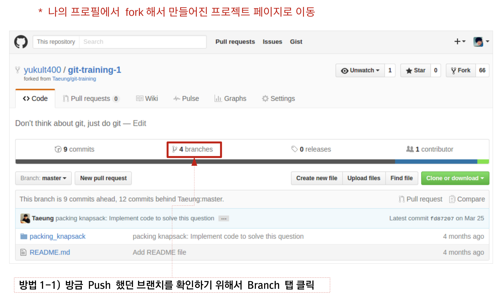
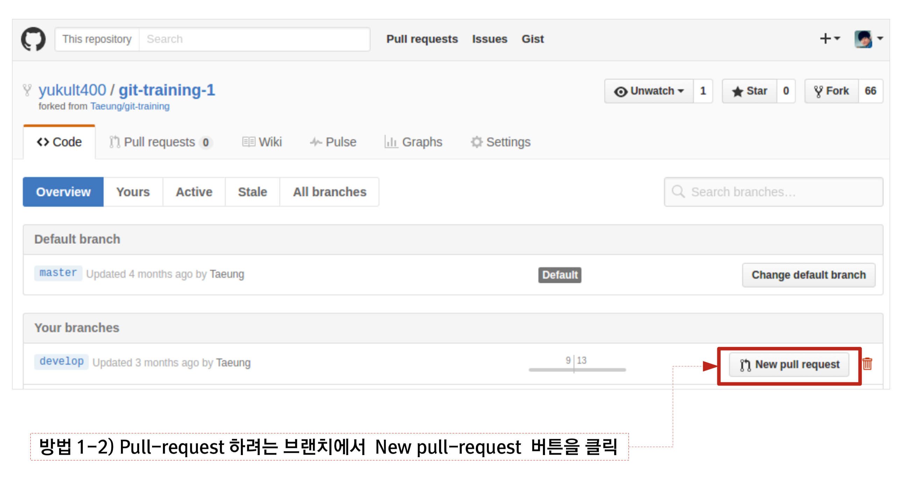
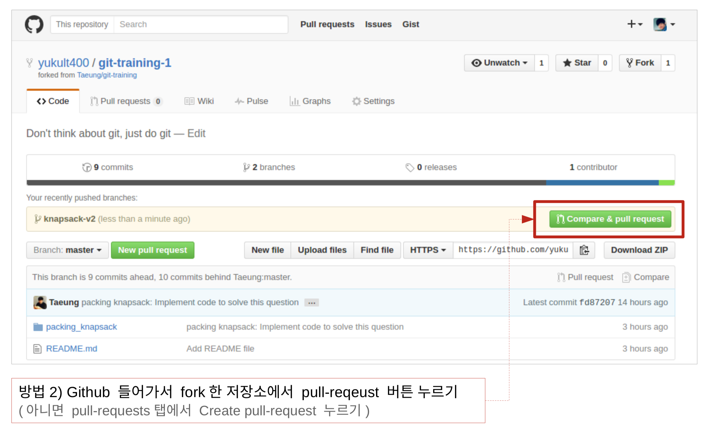
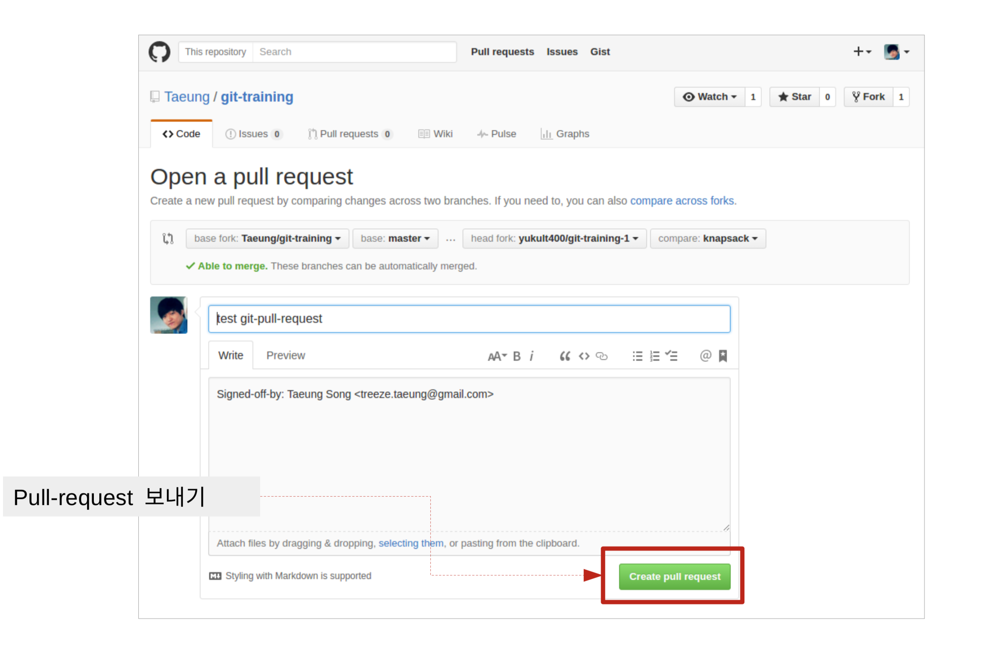
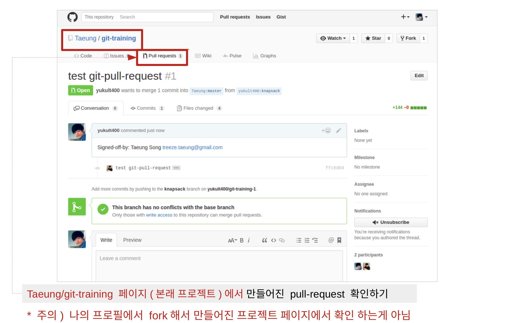

# Git에 대한 이해 & 설치

[Book](https://git-scm.com/book/ko/v2)

- [GitHub](http://github.com) 계정 만들기
- [Sourcetree](https://www.sourcetreeapp.com/) 를 설치
  - 작업은 반드시 터미널에서 진행합니다. Sourcetree와 같은 GUI도구는 중간에 과정을 생략합니다.
  - 그러나 뭔가를 할 때마다 Sourcetree를 계속 보시면 Git에 대해 알 수 있고, 무슨 일이 벌어지고 있는지도 알 수 있습니다.

## Git Style Guide 숙지

[ikaruce/git-style-guide](https://github.com/ikaruce/git-style-guide)

## 터미널 환경 설정

- Windows
  - WSL2를 공부하고 설치.
  - Windows terminal 설치.
  - Git 명령어 수행은 CLI 환경인 terminal에서 진행.
  - [WSL란?](https://docs.microsoft.com/ko-kr/windows/wsl/about)
  - [WSL 설치 및 WSL 2로 업데이트](https://docs.microsoft.com/ko-kr/windows/wsl/install-win10)
- Mac
  - iterm2 설치 후 iterm 터미널에서 진행
  - `brew install --cask iterm2`

## 시작하기

### 새 저장소 만들고 시작하기

```bash
git init
```

### 원격 저장소를 가져와서 시작하기

```bash
git clone <원격 저장소 주소>
```

### Sourcetree에 저장소 폴더 추가하기

Sourcetree를 실행해 방금 만들거나 가져온 폴더를 추가합니다.

뭔가를 할 때마다 Sourcetree를 계속 보시면 Git에 대해 알 수 있고, 무슨 일이 벌어지고 있는지도 알 수 있습니다.

## 원격 저장소 추가하기

### 원격 저장소 목록 확인

```bash
git remote
```

### 원격 저장소 정보 자세히 보기

```bash
git remote -v
```


- upstream - 공용 repository(보통 팀 repo)
- origin - 공용 repository 를 내 계정에 fork한 repository

### origin 원격 저장소 추가

주의) clone으로 원격 저장소를 가져오면 origin 원격 저장소가 이미 추가된 상태입니다.

아래는 git init 후 수동으로 원격 저장소를 추가할 때 사용하는 방법입니다.

```bash
git remote add origin <내 원격 저장소 주소>

git fetch origin
```

### upstream 원격 저장소 추가

```bash
git remote add upstream <공용 원격 저장소 주소>

git fetch upstream
```

### git fetch

[fetch(가져오기)【원격 저장소】 | 누구나 쉽게 이해할 수 있는 Git 입문~버전 관리를 완벽하게 이용해보자~ | Backlog](https://backlog.com/git-tutorial/kr/stepup/stepup3_2.html)

## 협업 시작하기

### Step #0

```bash
git clone <fork된 내 GitHub repository 주소>

git remote add upstream <공용 원격 저장소 주소>

git remote -v
```

upstream과 origin이 아래와 같은지 확인합니다.

- upstream - 공용 repository(보통 팀 repo)
- origin - 공용 repository 를 내 계정에 fork한 repository

git status

(git status는 수시로 해주는 게 좋습니다. 내가 의도한 작업이 수행 됐는지 수시로 확인합니다.)

### Step #1 - 작업 브랜치 만들기

```bash
git switch -c <브랜치 이름> upstream/main
```

upstream/main는 붙여서 쓰고, 가운데 슬래시(/)가 들어갑니다.

브랜치 이름은 작업한 내용을 표현해야 합니다. ex) login-oauth-apply


>Git 2.23 이전 버전인 경우, 아래와 같은 오류 메세지가 출력됩니다.
>> git: 'switch' is not a git command. See 'git --help'.

>해결방법
> <pre>
> - git을 최신버전으로 업데이트 하기 (권장)
> </br> 또는 </br>
> - 아래 방법으로 브랜치 작성과 체크아웃(브랜치 전환)을 함께 할 수 있습니다. </br>
> git checkout -b <브랜치 이름> upstream/main
></pre>

### Step #2 - upstream 원격 저장소의 최신 상태를 반영하기

```bash
git fetch upstream main

git rebase upstream/main
```

### Step #3 - 작업하기

원하는 작업을 이 시점에 합니다.

### Step #4 - 커밋

뭔가 바뀐 점을 추가합니다.

새 파일을 추가하는 게 아니라, 파일 추가/변경/삭제란 “바뀐 점”을 추가합니다.

```bash
git add .
```

방금 추가한 바뀐 점을 커밋합니다.

가능하면 메시지를 우리가 나중에 찾아볼 수 있는 형태로 씁니다.

```bash
git commit
```

### Git commit message style guide

반드시 숙지하고 지키려고 노력합시다.

[좋은 git 커밋 메시지를 작성하기 위한 8가지 약속](https://djkeh.github.io/articles/How-to-write-a-git-commit-message-kor/)

[Commit Message Style Guide For Git](https://commit.style/)

git commit 에디터는 vi 에디터를 기본적으로 씁니다.

주의) git commit -m "message" 는 쓰지 마세요. -m은 anti pattern입니다.

[Vi 에디터를 이용한 커밋 메시지 작성 방법](https://cau-dosc.github.io/how-to-write-commit-messages-using-vi.html)

### Step #5 - origin 원격 저장소에 작업 브랜치 올리기

```bash
git push origin <브랜치 이름>
```

origin과 <브랜치 이름> 사이엔 공백이 들어갑니다.

### Step #6 - Pull Request

GitHub에서 New Pull Request를 합니다.











## 작업 수정하기

Pull Request를 했지만 수정하고 싶을 때가 있습니다. 코드 리뷰 내용을 보고 반영하기 위해 고칠 때가 많은데, 해당 브랜치에 가서 Commit을 추가하고 Push만 하면 됩니다.

### Step #1 - 해당 브랜치로 이동하기

```bash
git switch <브랜치 이름>
```

### Step #2 - 수정하기

변경 작업을 이 시점에 합니다.

### Step #3 - 커밋

뭔가 바뀐 점을 추가합니다.

새 파일을 추가하는 게 아니라, 파일 추가/변경/삭제란 “바뀐 점”을 추가합니다.

```bash
git add .
```

방금 추가한 바뀐 점을 커밋합니다.

가능하면 메시지를 우리가 나중에 찾아볼 수 있는 형태로 씁니다.

```bash
git commit
```

### Step #4 - origin 원격 저장소에 작업 브랜치 올리기

```bash
git push origin <브랜치 이름>
```

### Step #5 - Pull Request가 바뀐 것 확인하기

뭔가 새로운 작업을 하지 않아도 Pull Request가 바뀐 것을 확인할 수 있습니다.

## Merge된 브랜치 정리하기

### Step #1 - 내 컴퓨터의 main 브랜치에 최신 코드 반영하기

#### main 브랜치로 이동

```bash
git switch main
```

#### 최신 코드 반영

```bash
git fetch upstream main

git rebase upstream/main
```

#### origin 원격 저장소에 main 브랜치를 올려보기 (필수는 아니지만 기분이 좋아짐)

```bash
git push origin main
```

### Step #2 - Merge된 브랜치 확인

내 컴퓨터에 있는 브랜치 중 Merge된 것 보기

이 목록에 main도 포함된다는 점에 주의!

```bash
git branch --merge
```

내 컴퓨터와 원격 저장소에 있는 브랜치 중 Merge된 것 보기

이 목록에 main도 포함된다는 점에 주의!

```bash
git branch -a --merge
```

### Step #3 - 내 컴퓨터의 브랜치 삭제

#### 안전하게 삭제

```bash
git branch -d <브랜치 이름>
```

#### 강제로 삭제

```bash
git branch -D <브랜치 이름>
```

### Step #4 - fork된 나의 원격 저장소 브랜치 삭제

```bash
git push origin :<브랜치 이름>
```

## PR 트레이닝

[https://github.com/CodeSoom/git-training](https://github.com/CodeSoom/git-training)

위 repo를 공용 repository로 하여
각자 이니셜로 만든 문서 파일(e.g. `csh.md`)을 추가하여

Pull Request를 날려봅니다.

## 참고 자료

- https://github.com/Taeung/git-training
