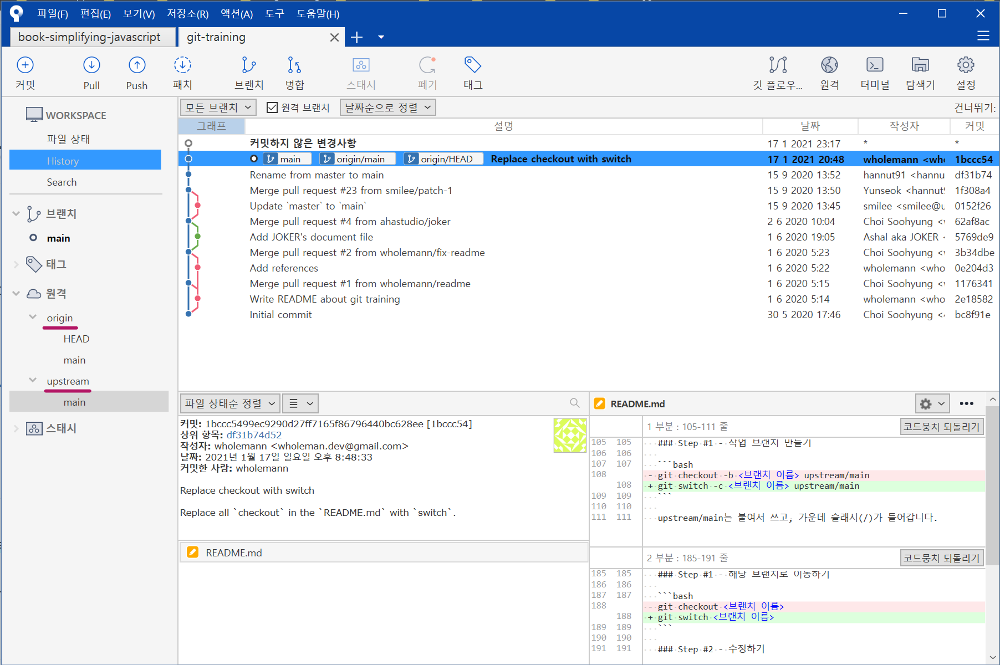
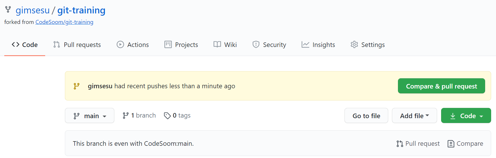
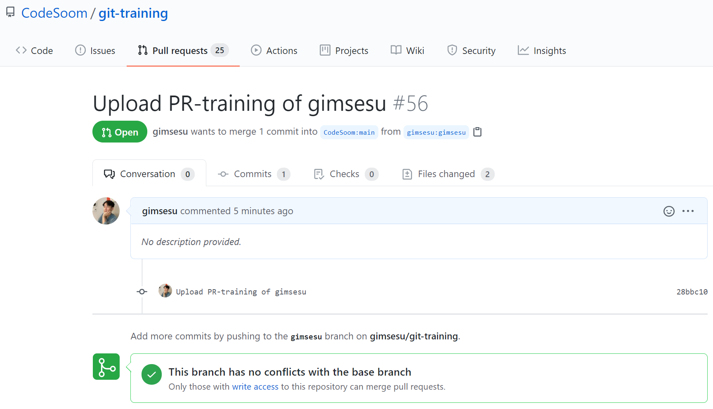
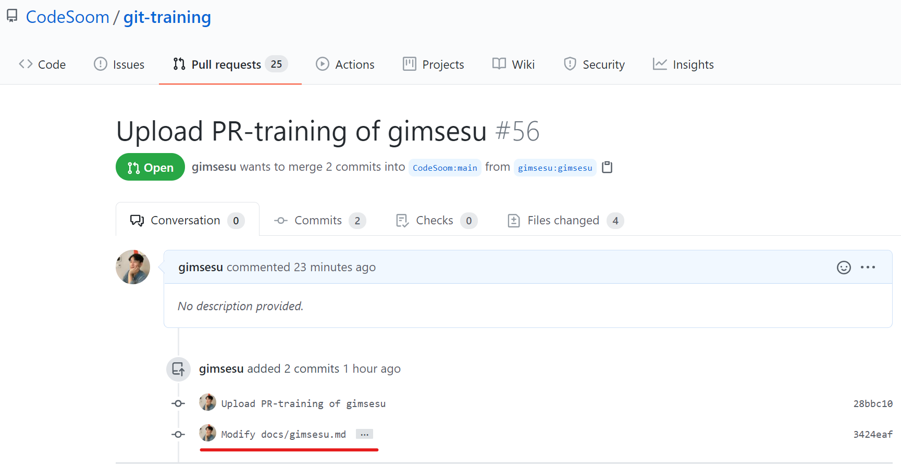

# git-training

## 터미널 환경

- Windows
  - Git Bash (PowerShell보다 익숙함..)


## 1) 시작하기

### clone

```shell
git clone https://github.com/gimsesu/git-training.git git-training
```


## 2) 원격 저장소 추가하기

### 원격 저장소 목록 확인

```shell
$ git remote
origin
```

### 원격 저장소 정보 자세히 보기

```shell
$ git remote -v
origin  https://github.com/gimsesu/git-training.git (fetch)
origin  https://github.com/gimsesu/git-training.git (push)
```

### upstream 원격 저장소 추가

```shell
$ git remote add upstream https://github.com/CodeSoom/git-training.git
```

```shell
$ $ git fetch upstream
From https://github.com/CodeSoom/git-training
 * [new branch]      main       -> upstream/main
```

upstream 추가 후 원격 저장소 정보 확인

```shell
$ git remote
origin
upstream
```

```shell
$ git remote -v
origin  https://github.com/gimsesu/git-training.git (fetch)
origin  https://github.com/gimsesu/git-training.git (push)
upstream        https://github.com/CodeSoom/git-training.git (fetch)
upstream        https://github.com/CodeSoom/git-training.git (push)
```

Sourcetree 모습




## 협업 시작하기

git status

```shell
$ git status
On branch main
Your branch is up to date with 'origin/main'.

Untracked files:
  (use "git add <file>..." to include in what will be committed)
        docs/gimsesu.md
        images/git_gimsesu_1.png
```

### Step #1 - 작업 브랜치 만들기

```shell
$ git switch -c gimsesu upstream/main
Switched to a new branch 'gimsesu'
Branch 'gimsesu' set up to track remote branch 'main' from 'upstream'.
```

### Step #2 - upstream 원격 저장소의 최신 상태를 반영하기

```shell
$ git fetch upstream main
From https://github.com/CodeSoom/git-training
 * branch            main       -> FETCH_HEAD

$ git rebase upstream/main
Current branch gimsesu is up to date.
```

### Step #3 - 작업하기

- docs/gimsesu.md 작성
- images/git_gimsesu_1.png 생성

### Step #4 - 커밋

변경 사항 추가

```shell
$ git add.
```

커밋

```
$ git commit
```

커밋 메시지 확인

```shell
$ git log
commit 28bbc10aacd42f1750e2646a1ce8e34c40d14ca3 (HEAD -> gimsesu, origin/gimsesu)
Author: gimsesu <tkfrn4799@gmail.com>
Date:   Sun Jan 17 23:30:58 2021 +0900

    Upload PR-training of gimsesu
```

```shell
$ git log --oneline
28bbc10 (HEAD -> gimsesu, origin/gimsesu) Upload PR-training of gimsesu
```

### Step #5 - origin 원격 저장소에 작업 브랜치 올리기

```shell
$ git push origin gimsesu
Enumerating objects: 9, done.
Counting objects: 100% (9/9), done.
Delta compression using up to 8 threads
Compressing objects: 100% (6/6), done.
Writing objects: 100% (6/6), 273.69 KiB | 18.25 MiB/s, done.
Total 6 (delta 1), reused 0 (delta 0), pack-reused 0
remote: Resolving deltas: 100% (1/1), completed with 1 local object.
remote:
remote: Create a pull request for 'gimsesu' on GitHub by visiting:
remote:      https://github.com/gimsesu/git-training/pull/new/gimsesu
remote:
To https://github.com/gimsesu/git-training.git
 * [new branch]      gimsesu -> gimsesu
```

### Step #6 - Pull Request

내 프로필의 fork 프로젝트에서 pull-request 수행



pull-request 확인



## 작업 수정하기

### Step #1 - 해당 브랜치로 이동하기

```shell
$ git switch gimsesu
```

### Step #2 - 수정하기

- docs/gimsesu.md 수정
- images/git_gimsesu_2.png 생성
- iamges/git_gimsesu_3.png 생성
- 이미지 경로 수정

### Step #3 - 커밋

```shell
$ git add .
```

```shell
$ git commit
```

커밋 메시지 확인

```shell
$ git log
commit 3424eafc52ef4602e5d27c1188fe9f3c48543f17 (HEAD -> gimsesu)
Author: gimsesu <tkfrn4799@gmail.com>
Date:   Mon Jan 18 00:10:52 2021 +0900

    Modify docs/gimsesu.md

    Create images/git_gimsesu_2.png
    Create images/git_gimsesu_3.png
```

### Step #4 - origin 원격 저장소에 작업 브랜치 올리기

```shell
$ git push origin gimsesu
```

### Step #5 - Pull Request가 바뀐 것 확인하기

내가 방금 추가로 커밋한 내용을 확인할 수 있다.



